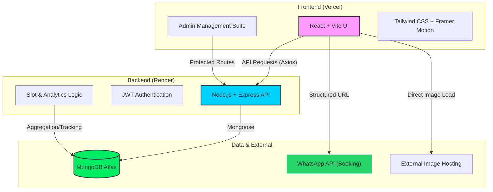

# Architecture Diagram - Star Zone Salon

This diagram illustrates the high-level architecture of the Star Zone project, showing the flow between the user interface, the backend management, and the data layers.

## System Components

1.  **Frontend (Hosted on Vercel)**:
    *   **React + Vite**: Provides a fast, responsive user experience.
    *   **Context API**: Handles global state (Cart, User Data, Auth).
    *   **Framer Motion**: Powers the premium luxury animations.
2.  **Backend (Hosted on Render)**:
    *   **Express.js**: RESTful API handles all requests.
    *   **JWT**: Secures the Admin Panel routes.
3.  **Database (MongoDB Atlas)**:
    *   **Collections**: Stores Services, Content, Users, Analytics, and Time Slots.
4.  **Integration**:
    *   **WhatsApp**: Instead of a complex email server, we use structured WhatsApp links for high-conversion booking.
